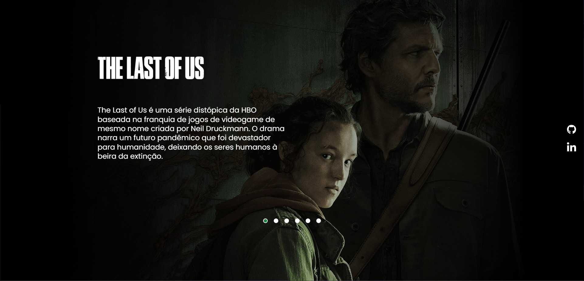

<h1 align="center"> The Last Of Us </h1>

Projeto desenvolvido pelos irmãos Roberto e Ricardo Dias fundadores do DEVEMDOBRO!

  <a href="#-tecnologias">Tecnologias</a>&nbsp;&nbsp;&nbsp;|&nbsp;&nbsp;&nbsp;
  <a href="#-projeto">Projeto</a>&nbsp;&nbsp;&nbsp;|&nbsp;&nbsp;&nbsp;
  <a href="#memo-licença">Licença</a>

  

 

  

## 🚀 Tecnologias

Esse projeto foi desenvolvido com as seguintes tecnologias:

- HTML
- SASS
- JavaScript

## 💻 Projeto

O projeto foi realizado durante o evento Do zero ao programador contratado! Apresenta uma interface com imagens da série e informações de onde a HBO Max se baseou para a criação dela. 

## :memo: Licença

Esse projeto está sob a licença MIT.
